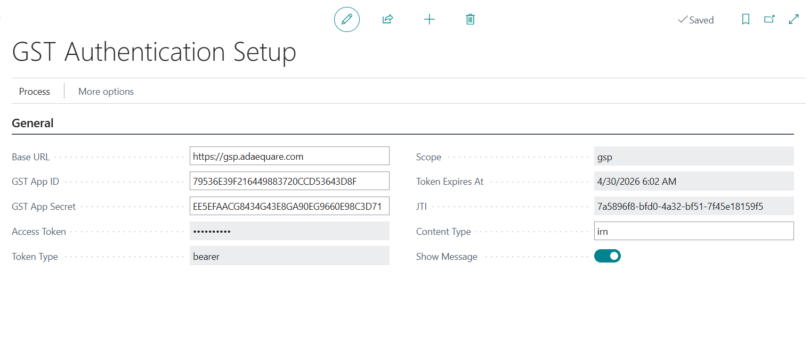
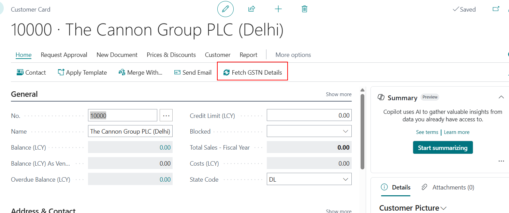
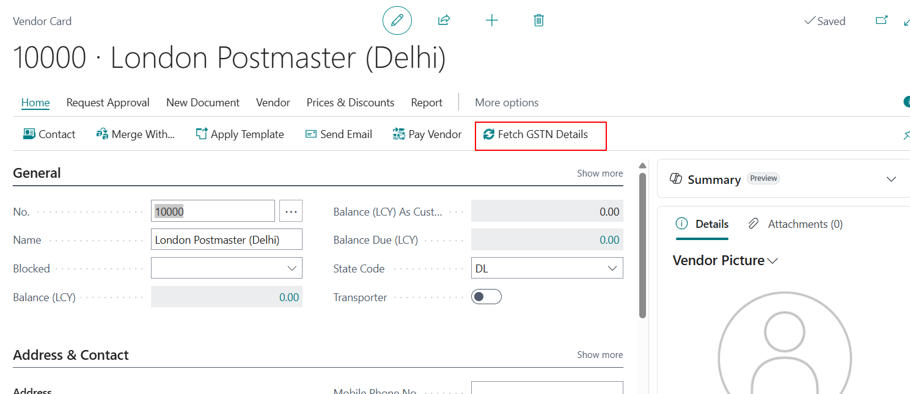
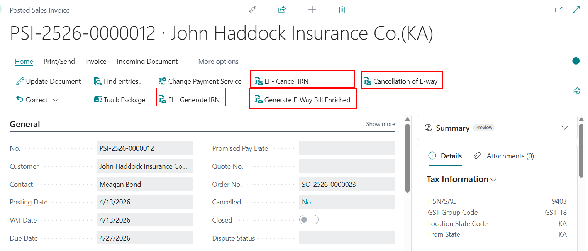

# GSTN Extension User Process Document

## Overview
This document describes the user process for the `GSTN` Business Central extension.
It covers the current setup pages, customer/vendor actions, invoice actions, and staging pages.

---

## 1. Installation

1. Deploy the `GSTN` extension package to your Business Central environment.
   - Use the `.app` file for the version you want to install.
   - Publish the extension from the Business Central Extension Management page.
2. Verify that the extension is installed successfully.
   - Open Extensions Management in Business Central.
   - Confirm `GSTN` appears in the installed extensions list.

### Screenshot

---

## 2. GST Authentication Setup

1. Open the page `GST Authentication Setup`.
2. Enter the required values:
   - `Base URL`
   - `GST App ID`
   - `GST App Secret`
3. Use `Generate Token` to request a new access token.
4. Confirm the prompt and verify that the token fields are updated.

### Screenshot

---

## 3. Customer and Vendor GSTN Detail Fetching

### Customer
1. Open the standard `Customer Card` page.
2. Use the `Fetch GSTN Details` action in the Processing actions.
3. Confirm the prompt to fetch and update GSTN details for the current customer.
4. Review the updated customer GSTN fields.

### Screenshot

### Vendor
1. Open the standard `Vendor Card` page.
2. Use the `Fetch GSTN Details` action in the Processing actions.
3. Confirm the prompt to fetch and update GSTN details for the current vendor.
4. Review the updated vendor GSTN fields.

### Screenshot

---

## 4. Posted Sales Invoice Actions

1. Open the standard `Posted Sales Invoice` page.
2. Select the invoice to process.
3. Use `EI - Generate IRN` to generate an IRN for the selected invoice.
4. Use `EI - Cancel IRN` to cancel IRN generation after it has been created.
5. Use `Generate E-Way Bill Enriched` to generate an enriched e-way bill.
6. Use `Cancellation of E-way` to cancel an existing e-way bill.
7. Review the `IRN QR Code` FactBox on the invoice page for generated QR code data.

### Screenshot

---

## 5. Staging Pages

### GSTN Search Staging
1. Open the `GSTN Search Staging` page.
2. Review staging records for GSTN search responses.
3. Check fields like `Success`, `Message`, `GSTIN`, and `Registration Date`.

### E-Invoice IRN Staging
1. Open the `E-Invoice IRN Staging` page.
2. Review IRN generation and cancellation records.
3. Check fields like `IRN`, `Ack No.`, `Ack Date`, and `IRN Status`.

### EWay Bill Staging
1. Open the `EWay Bill Staging` page.
2. Review e-way bill generation and cancellation records.
3. Check fields like `Eway Bill No`, `Eway Bill Date`, `Valid Upto`, and `Alert`.

### Screenshot

---

## 6. Permissions and Support

- Ensure your user role has access to the `GSTN` pages and actions.
- If an issue occurs, capture the error or message text and report it to support.
- Use the staging pages to verify request outcomes and troubleshoot failed or canceled requests.

### Screenshot

---

## Notes

